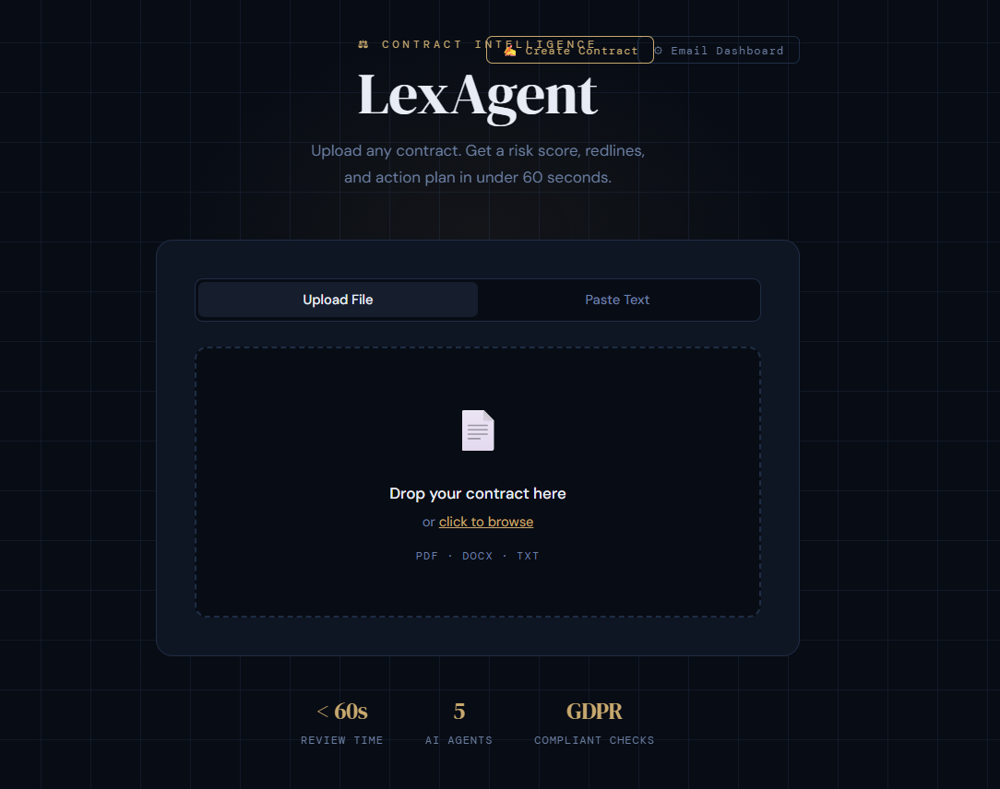

# ⚖️ LexAgent — Autonomous Multi-Source Contract Intelligence Platform

<div align="center">

[](https://www.python.org/)
[](https://fastapi.tiangolo.com/)
[](https://react.dev/)
[](LICENSE)

**Intelligent contract analysis powered by AI agents** 🤖\
Analyze contracts from Email, Upload, WhatsApp, or API. Get risk scores, redlines, and action plans in seconds.

[Features](#-features) • [Architecture](#-architecture) • [Quick Start](#-quick-start) • [Demo](#-screenshots--demo)

</div>

---

## 🚀 Overview

### 📺 Live Demo

<div align="center">

[](https://youtu.be/3eStSCgKrpk)

**Click to watch the LexAgent demo** — See contract analysis in action!

</div>

---

LexAgent is a **multi-agent AI system** that automatically reviews contracts from multiple sources:

- 📥 **Email** — Gmail integration with auto-polling
- 📤 **File Upload** — PDF, DOCX, TXT support
- 💬 **WhatsApp** — Real-time messaging integration
- 📄 **Raw API** — Direct text input

It processes contracts through a **modular AI pipeline** and produces:

- ⚖️ **Risk Score** (0–100 scale)
- 🔍 **Clause Detection** — Identify risky clauses
- ✍️ **Redlines** — AI-suggested improvements
- 📉 **Compliance Alerts** — GDPR, SLA checks
- 📋 **Action Checklist** — Prioritized tasks
- 📊 **Structured Reports** — JSON format
- 📤 **Auto Replies** — Email & WhatsApp responses

---

## 🧠 Architecture

```
┌─────────────────────────────────────┐
│   Input Sources                     │
│  📥📤💬📄 (Email/Upload/WhatsApp/API)│
└──────────────┬──────────────────────┘
               ↓
┌─────────────────────────────────────┐
│   Parse Agent                       │
│   Extract clauses & structure       │
└──────────────┬──────────────────────┘
               ↓
┌─────────────────────────────────────┐
│   Flag Agent                        │
│   Risk scoring & detection          │
└──────────────┬──────────────────────┘
               ↓
┌─────────────────────────────────────┐
│   Compare Agent                     │
│   Match rules, GDPR, SLA            │
└──────────────┬──────────────────────┘
               ↓
┌─────────────────────────────────────┐
│   Redline Agent                     │
│   Generate improvements             │
└──────────────┬──────────────────────┘
               ↓
┌─────────────────────────────────────┐
│   Report Agent                      │
│   Structure final output            │
└──────────────┬──────────────────────┘
               ↓
┌─────────────────────────────────────┐
│   Output                            │
│  🎯 UI • 📊 JSON • 💬 Auto-replies   │
└─────────────────────────────────────┘
```

### 🤖 AI Agent Pipeline

| Agent | 📝 Responsibility | 🎯 Output |
|-------|-------------------|----------|
| **Parse** | Extract clauses from documents | Structured clauses |
| **Flag** | Detect risky clauses & assign scores | Risk flags & scores |
| **Compare** | Match against playbook & GDPR rules | Compliance report |
| **Redline** | Suggest improved clause wording | Redlined document |
| **Report** | Generate final structured output | JSON report |

---

## 🛠️ Tech Stack

### Backend 🔹
- **FastAPI** — Async REST API framework
- **Python 3.10+** — Core language
- **Uvicorn** — ASGI server
- **AsyncIO** — Async/await concurrency

### AI Layer 🤖
- **OpenRouter** — LLM gateway (multi-model support)
- **OpenAI SDK** — API client
- **Prompt Engineering** — Agent orchestration

### Frontend 🎨
- **React 18+** — UI framework
- **Vite** — Build tool & dev server
- **Zustand** — Lightweight state management
- **Tailwind CSS** — Utility-first styling
- **Recharts** — Data visualization

### Integrations 🔗
- **Gmail API** — OAuth2 email integration
- **WhatsApp Business API** — Meta integration
- **File Processing** — PDF/DOCX/TXT parsing

### Storage 💾
- **JSON Reports** — `/backend/reports/`
- **Rule Configs** — `gdpr.json`, `playbook.json`

---

## ✨ Features

### 📥 Multi-Source Input
- ✅ Email ingestion with auto-polling
- ✅ Drag-and-drop file upload (PDF, DOCX, TXT)
- ✅ WhatsApp messaging integration
- ✅ Direct API input

### 🤖 Smart AI Processing
- ✅ Automatic clause extraction
- ✅ Risk scoring algorithm
- ✅ Compliance detection
- ✅ Intelligent redlining

### ⚙️ Automation
- ✅ Auto-reply emails
- ✅ WhatsApp responses
- ✅ Background processing queues
- ✅ Parallel agent execution

### 📊 Interactive Dashboard
- ✅ Risk scorecard visualization
- ✅ Detailed clause table
- ✅ Before/after diff view
- ✅ Missing clauses alerts
- ✅ Actionable checklist

---

## 📋 Prerequisites

| Component | Version | Required |
|-----------|---------|----------|
| Python | 3.10+ | ✅ |
| Node.js | 18+ | ✅ |
| npm / yarn | Latest | ✅ |
| Git | Any | ✅ |
| Gmail Account | OAuth2 | Optional |
| WhatsApp Business | Meta Account | Optional |

---

## 🚀 Quick Start

### 1️⃣ Clone Repository

```bash
git clone https://github.com/your-username/lexagent.git
cd lexagent
```

### 2️⃣ Backend Setup

```bash
cd backend

# Create virtual environment
python -m venv venv

# Activate (Windows)
venv\Scripts\activate

# Or activate (macOS/Linux)
source venv/bin/activate

# Install dependencies
pip install -r requirements.txt
```

### 3️⃣ Environment Configuration

Create `backend/.env`:

```env
# OpenRouter API Key
OPENROUTER_API_KEY=your_api_key_here

# Gmail Integration
GMAIL_CREDENTIALS_FILE=gmail_credentials.json
GMAIL_TOKEN_FILE=gmail_token.json

# WhatsApp Integration
WHATSAPP_TOKEN=your_token_here

# OpenRouter Settings
OPENROUTER_MODEL=meta-llama/llama-2-70b-chat
```

### 4️⃣ Frontend Setup

```bash
cd frontend

# Install dependencies
npm install
```

Create `frontend/.env`:

```env
VITE_API_BASE_URL=http://localhost:8000
```

---

## ▶️ Running the Project

### Start Backend

```bash
cd backend
uvicorn app.main:app --reload
```

Backend will run at: `http://localhost:8000`

### Start Frontend

```bash
cd frontend
npm run dev
```

Frontend will run at: `http://localhost:5173`

### Access Points 🌐

| Service | URL | Purpose |
|---------|-----|---------|
| **Frontend** | http://localhost:5173 | Web UI |
| **Backend** | http://localhost:8000 | REST API |
| **API Docs** | http://localhost:8000/docs | Interactive Swagger UI |
| **ReDoc** | http://localhost:8000/redoc | API documentation |

---

## 📡 API Examples

### Process Contract via API

```bash
curl -X POST http://localhost:8000/api/process \
  -H "Content-Type: application/json" \
  -d '{
    "content": "Liability is limited to $100",
    "source": "api"
  }'
```

### Upload File

```bash
curl -X POST http://localhost:8000/api/upload \
  -F "file=@contract.pdf"
```

### Get Report

```bash
curl http://localhost:8000/api/reports/{report_id}
```
---

## 📸 Screenshots & Demo

### 🖼️ UI Components

| Component | Feature |
|-----------|---------|
| **Upload Page** | Drag-and-drop file upload with progress tracking |
| **Dashboard** | Risk scorecard with real-time metrics |
| **Risk Scorecard** | Visual representation of contract risk (0-100) |
| **Diff View** | Side-by-side before/after comparison |

### 🎥 Demo Video

[Watch Demo](https://youtu.be/3eStSCgKrpk) — See LexAgent in action

---

## 💡 Use Cases

- 🏢 **Legal Departments** — Automate contract reviews
- 🚀 **Startups** — Quick vendor agreement analysis
- ✅ **Compliance Teams** — GDPR & SLA monitoring
- 🛒 **Procurement** — Risk evaluation for purchases
- 📧 **In-House Counsel** — Email-based contract processing
- 💬 **Sales Teams** — WhatsApp contract discussions

---

## 🏗️ Project Structure

```
lexagent/
├── backend/
│   ├── app/
│   │   ├── agents/           # 🤖 AI agent modules
│   │   │   ├── parse_agent.py
│   │   │   ├── flag_agent.py
│   │   │   ├── compare_agent.py
│   │   │   ├── redline_agent.py
│   │   │   └── report_agent.py
│   │   ├── routes/           # 🌐 API endpoints
│   │   │   └── email_routes.py
│   │   ├── rules/            # 📋 Compliance rules
│   │   │   ├── gdpr.json
│   │   │   └── playbook.json
│   │   ├── tools/            # 🔧 Utilities
│   │   │   └── flag_clause_schema.py
│   │   ├── orchestrator.py   # 🎯 Agent coordinator
│   │   ├── main.py           # 🚀 Entry point
│   │   └── api.py            # API definitions
│   ├── reports/              # 📊 Output reports
│   ├── tests/                # ✅ Unit tests
│   ├── requirements.txt      # 📦 Dependencies
│   └── gmail_*.json          # 🔐 Credentials
│
├── frontend/
│   ├── src/
│   │   ├── components/       # ⚛️ React components
│   │   │   ├── ClauseTable.jsx
│   │   │   ├── RiskScorecard.jsx
│   │   │   ├── DiffView.jsx
│   │   │   └── ActionChecklist.jsx
│   │   ├── pages/            # 📄 Page views
│   │   │   ├── UploadPage.jsx
│   │   │   ├── DashboardPage.jsx
│   │   │   └── ResultsPage.jsx
│   │   ├── api/              # 🌐 API client
│   │   │   └── client.js
│   │   ├── store.js          # 📦 State management
│   │   ├── App.jsx
│   │   └── main.jsx
│   ├── vite.config.js        # ⚙️ Vite config
│   └── package.json
│
└── README.md
```

---

## 🧪 Testing

### Run Tests

```bash
cd backend

# Run all tests
pytest tests/ -v

# Run specific test file
pytest tests/test_parse.py -v

# Run with coverage
pytest --cov=app tests/ -v
```

### Test Files

- `test_parse.py` — Parse agent unit tests
- `test_flag.py` — Risk flagging tests
- `test_pipeline.py` — End-to-end pipeline tests

---

## ⚠️ Known Challenges & Solutions

| Challenge | Impact | Solution |
|-----------|--------|----------|
| **API Rate Limiting** | 429 errors | Sequential processing + backoff |
| **Async Coordination** | Pipeline delays | AsyncIO task orchestration |
| **Email Spam** | False positives | Sender filtering & validation |
| **Multi-Source Format** | Inconsistent data | Modular normalization agents |
| **LLM Consistency** | Variable outputs | Structured JSON constraints |

---

## 💡 Design Principles

- 🏗️ **Modular Architecture** — Independent, swappable agents
- ⚡ **Async-First** — Non-blocking I/O throughout
- 🧹 **Clean Code** — Readable, maintainable structure
- 🔀 **Separation of Concerns** — Single responsibility per agent
- 📦 **Reusable Components** — DRY principle

---

## 🎯 Quality Standards

✅ **Code Organization**
- Clean folder structure
- Meaningful file/class naming
- Clear module boundaries

✅ **Implementation**
- Comprehensive error handling
- Input validation
- Graceful degradation

✅ **Maintainability**
- Inline documentation
- Consistent style
- Type hints where applicable

---

## 🚀 Future Roadmap

### 🔜 Short Term
- [ ] Redis queue (Celery/RQ) for job scheduling
- [ ] WebSocket real-time updates
- [ ] Multi-user authentication

### 📅 Medium Term
- [ ] Playbook customization UI
- [ ] DocuSign integration
- [ ] Contract templates library
- [ ] Advanced audit logging

### 🌟 Long Term
- [ ] ML model fine-tuning
- [ ] Custom LLM deployment
- [ ] Enterprise SSO
- [ ] Advanced analytics dashboard

---

## 🤝 Contributing

We welcome contributions! Please follow these steps:

1. **Fork** the repository
2. **Create** a feature branch (`git checkout -b feature/amazing-feature`)
3. **Commit** changes (`git commit -m 'Add amazing feature'`)
4. **Push** to branch (`git push origin feature/amazing-feature`)
5. **Open** a Pull Request

### Contribution Guidelines
- Follow PEP 8 for Python code
- Use meaningful commit messages
- Add tests for new features
- Update documentation

---

## 📄 License

This project is licensed under the **MIT License** — see [LICENSE](LICENSE) file for details.

---

## ✉️ Contact & Support

- **Email** — support@lexagent.dev
- **Issues** — [GitHub Issues](https://github.com/your-username/lexagent/issues)
- **Discussions** — [GitHub Discussions](https://github.com/your-username/lexagent/discussions)

---

## 🙏 Acknowledgments

- Built with ❤️ by the LexAgent team
- Powered by OpenRouter & OpenAI
- Inspired by modern AI agent architectures
- Thanks to all contributors

---

<div align="center">

**[⬆ Back to Top](#-lexagent—autonomous-multi-source-contract-intelligence-platform)**

Made with 💙 for Legal Tech Innovation

</div>
Slack / Teams bot

🎯 Demo Flow (Quick)
Upload contract
View risk score
Explore redlined clauses
Check missing clauses
Trigger email/WhatsApp processing

📄 License

MIT License